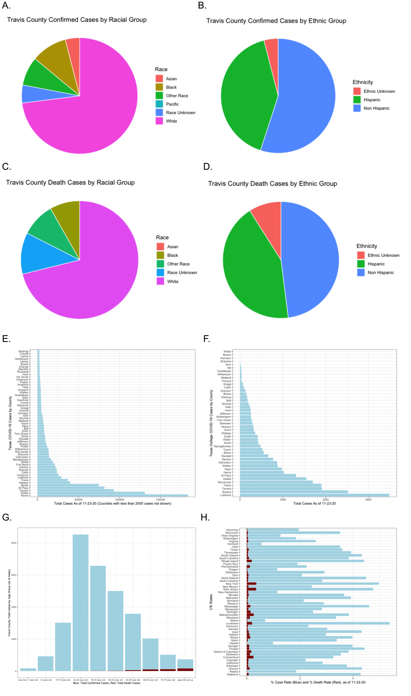

##Group 12: Ling Zhou, Alexis Hill, Kendra Zwonitzer Maclaine

### Abstract

The novel coronavirus, designated as the severe acute respiratory syndrome coronavirus-2 (SARS-CoV-2), has been causing an ongoing pandemic worldwide. As of December 2, 2020, the virus has caused 64,844,711 global cases, and 1.5 million deaths have been reported. The common routes of transmission are contact and droplet transmission as well as airborne transmission. Even though the virus is causing deadly symptoms and is highly transmissible, no vaccine is currently available to protect against it. Therefore, we developed a coronavirus disease (COVID-19) information application to help educate the public about the virus and to provide analysis to help people make safer decisions during the pandemic. The COVID-19 dashboard contains interactive maps for the state of Texas with both county activity data from a google dataset and COVID-19 cases. Our application also provides local behavior recommendations for individual counties, such as the best day to go shopping or to the park during the week. In the analysis section, we explore how COVID-19 outcomes vary by demographic (age, race, sex, etc.), and investigate how population level attributes influence COVID-19 severity on the county level.

### Introduction

COVID-19 has affected the entire globe. In the US alone, there have been almost 300,000 deaths from the severe acute respiratory syndrome coronavirus-2 (SARS-CoV-2). Experts have predicted that it will take at least until the end of 2021 for global life to return to "normal" (healthline). Though global data and concerns about COVID can be overwhelming, it is important that each person stays educated on their local COVID situation. This was the motivation behind creating our Shiny app for counties in the state of Texas. We obtained community activity data and COVID case data to create a local and accessible COVID-19 dashboard. We predicted that overall activity would show a sharp decrease at the beginning of the pandemic and then a slow increase toward normal over time. We were also interested in how COVID-19 trends appeared in urban vs. more rural Texas counties.

COVID-19 has disproportional impacts on different locations, age groups and racial groups. Understanding the local distributions of confirmed cases and deaths will get allow us to better prepare for the future and take actions to protect ourselves. Specifically, COVID-19 data demographic analysis could provide guidance for resource allocation and incoming vaccine distribution.

### Overall goals

1. Learn how to use and deploy Shiny apps with interactive graphs/maps.
2. Create a COVID-19 interactive dashboard using Shiny to gain insignt into local COVID-19 trends.
3. Learn about the possibilities and limits about how publicly available COVID data can be used to help the public.

### Data Sources and computational methods

R version 4.0 was used to generate all graphs. Tidyverse was used to clean data. The app was created and deployted using Shiny. Interactive maps were made with leaflet. Interactive graphs showing county-level activity and cases were created using ggplot. The app is stored on a shiny server.

Texas county polygons were downloaded using the tigris package. Activity datasets were downloaded from google: https://www.google.com/covid19/mobility/. COVID-19 case data was taken from the NYtimes github: https://github.com/nytimes/covid-19-data. 

The app is available at: https://kmaclaine.shinyapps.io/shiny_app/. Code for the app can be found at: https://github.com/alexismhill3/mol290c (remember to make it public)

COVID-19 college cases data source: https://github.com/nytimes/covid-19-data/tree/master/colleges. Travis county local COVID-19 cases and demographic information data was taken from Austin-Travis County COVID-19 Dashboard Public Datasets: https://experience.arcgis.com/experience/3793562ab87e4299b106e0c282bb1fc5.

### Results

#### Activity Data in Texas Counties

Overall, most counties' activity trend fowllowed a similar pattern. Activity dropped during the first few weeks of the pandemic and then increased. More urban and populated counties tended not to return to normal activity levels after the drop, while less populated counties tended to see activity return to normal levels, especially in the grocery category (Figure 1A). An example of this is shown in figure 1A, comparing Travis county, which is more urban, to Potter county, which is more rural.

Each day of the week was averaged over the last 4 weeks in the dataset. Friday showed the higheset activity score and Monday showed the lowest in grocery and shopping categories in Travis county. In Potter county, Thursday had the highest activity score in both counties, while Wednesday and Monday had the lowest activity scores for shopping and grocery respectively (Figure 1A).

Another result from this dataset is the difference in state-wide response in the categories of grocery and shopping. The shopping/restaurant activity started out at baseline pre-COVID19 and decreased as the pandemic set-in. The grocery activity started out at baseline pre-COVID19, took a huge activity spike at the onset of the pandemic (we believe we have visualized the toilet paper shortage), then went below baseline as the pandemic set in (Figure 2).

**Local COVID-19 Demographic and County-level Plots** 

COVID-19 is reported to have been disproportionally affecting the minority and the elderly groups. Knowing the trend of case and death distributions can provide guidance for public health practices as well as guidance for vaccine and resource distribution. Therefore, in this section, we aim to use both nation-wide and Texas local public datasets to analyze COVID-19 case and death distributions among different locations, racial and ethnic groups and age groups. Nation-wide, as of the end of November, we see the highest death confirmed case per capita of 5.87% in Louisiana, and the highest death per capita in New York and New Jersey at over 0.37%. Texas ranks the 24th (from high to low) for total confirmed cases per capita nation-wide, and the 22nd (from high to low) for total deaths per capita nation-wide (Figure 2H).

Within Texas, Harris county, Dallas county and Tarrant have the highest number of confirmed cases by the end of November, and Travis county has the 7th highest number of cases within Texas (Figure 2E). 

We also looked at the Texas confirmed case distributions within colleges and universities by county, and our analysis shows that Lubbock county, Brazos county and Tarrant county have the highest numbers of cases from colleges and universities. Travis county has the 4th highest number of cases reported from local colleges and universities (Figure 2F). 

To take a closer look at the demographic information of the confirmed and death cases within Travis county, we analyzed data from Austin-Travis County COVID-19 Dashboard Public Datasets available online and plotted the distributions of total confirmed and death cases by age group. Based on our analysis, by the end of November, the highest number of cases falls into the younger population age between 20 to 39, but very low amount of death cases was reported within these age groups. Unlike the younger generations with relatively less pre-existing health conditions, people over 50 years old has much higher death rates as their age increases, with the group “ages 80 and up” being hit the most strongly by COVID-19 (Figure 2G). 

We also looked at the racial and ethnical distribution of local cases (Figure 2A, 2C), and we found that white people contributed to the biggest proportion of the local cases while the minorities (73%) comparing to the minoritized groups (Asian: 4%, Black: 10%, Pacific: 0%, Other: 8%). Surprisingly, Asian has 0% reported death locally, and White has 69% highest death percentage in Austin (Black: 8%, Other: 9%). 

Non-Hispanics group has slightly higher proportion of confirmed cases compared to Hispanics, and the death case proportions are relatively equal among the two groups (Figure 2B, 2D).

With all the information above, we saw that the younger generations are the main group who’s contracting and potentially spreading the disease, but the aged groups are the ones who are dying from it. Racial- and ethnic-wise, the white population are the largest population who are contracting the disease, and the proportion is close to the proportion of the White population (70.8%, Austin, TX Census Place, https://datausa.io) in Austin. Data analysis limitations in this section includes 1) the Texas college total cases analysis may be biased towards the universities that are rigorously testing and reporting the cases as there is no state-wise standards for testing and reporting among colleges and universities, and 2) it is difficult to give statistical significance conclusions on the case distribution analysis as there are no duplicates available for standard error calculation for case reporting.

<!--  -->
<!-- # -->
<!-- # -->
<!-- # -->
<!-- # -->
<!-- # -->
<!-- # -->

### Conclusions

Different Texas communities showed different activity patterns during COVID-19. Urban counties in Texas seemed to be less likely to have their activity scores return to normal after the initial drop in activity, while less populated counties tended to show a better recovery in community activity.

Grocery stores showed a huge spike in activity at the onset of the pandemic, while other retail stores did not have this spike.

### Author Contributions

Ling:

Alexis:

Kendra: Learned and set-up the shiny app, deployed the app on the shiny server, made the gif on the front page, and made the interactive plots on the "COVID-19 Dashboard: State and County" tab. Wrote the results for my plots, contributed to abstrct and introduction.

https://www.healthline.com/health-news/fauci-and-other-experts-debate-when-our-covid-19-lives-will-return-to-normal#3

